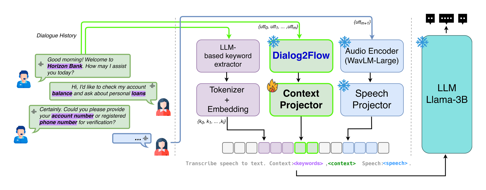

<!--
SPDX-FileCopyrightText: Copyright © 2026 Idiap Research Institute <contact@idiap.ch>

SPDX-License-Identifier: MIT
-->

# Context Projector: Complementary Keyword and Dialogue Context Embeddings for LLM-based ASR

> **Quick Links:** [The idea](#-the-idea-context-as-tokens-not-as-text) · [Reproducing the paper](#-reproducing-the-paper) · [Expected results](#-expected-results) · [Scripts](scripts/README.md) · [Data preparation](data_prep/README.md) · [Installation](#-installation) · [Citation](#-citation)

This repo contains the code to reproduce our <a href="https://www.isca-archive.org/interspeech_2026/villatorotello26_interspeech.html">Interspeech 2026 paper</a>.

## 💡 The idea: context as tokens, not as text

In **LLM-based ASR**, a speech encoder is wired to an LLM by a small trainable *projector*, which maps speech into the LLM's input embedding space.
The LLM reads those embeddings together with a text prompt and writes out the transcript.

In a contact-center call, the words that matter most are often the ones the conversation has already mentioned: the bank, the product, the account type.
So the obvious move is to paste the dialogue history into the prompt and let the LLM use it.
We tried exactly that, and it mostly makes things worse:

| Prompt context (WER %) | Banking | Healthcare | Insurance | Retail | Teleco |
|------------------------|--------:|-----------:|----------:|-------:|-------:|
| none (base model) | 11.56 | **15.24** | **9.98** | **16.79** | **13.09** |
| keywords of previous turns | **11.51** | 16.84 | 10.35 | 17.75 | 13.70 |
| previous turn | 11.85 | 16.82 | 10.60 | 18.14 | 13.48 |
| last 10 turns | 12.63 | 95.03 | 12.67 | 19.71 | 14.87 |

The keywords do help on the entities themselves (bias WER drops in every domain), but the extra text distracts the model from what was actually said, and a long raw history can derail decoding completely.

Our hypothesis is that the history is useful, but not in the form of raw text.
So we give the LLM two complementary signals instead:

<p align="center">
  
</p>

<pre>
<b>prompt</b>   Transcribe speech to text. Context: <b>{keywords}</b>, <b>{context}</b> Speech: <b>{speech}</b>.

<b>{keywords}</b>  keywords of the previous turns, extracted by an LLM     ("BANK OF AMERICA, CREDIT CARD")
<b>{context}</b>   one token per previous turn: its Dialog2Flow sentence
            embedding, mapped into the LLM space by the <b>context projector</b> cp(·)
<b>{speech}</b>    the projected speech embeddings sp(z<sub>1</sub>), ..., sp(z<sub>n</sub>)
</pre>

The context projector has the same architecture as the speech projector (one hidden layer of 2048 units) and is trained on its own, on top of a frozen base model, so it is a drop-in addition to an existing LLM-based ASR system.
Combining both signals (`+kw+cp`) lowers the bias WER over the base model in every domain without raising the WER by more than 0.05 points anywhere, which neither signal achieves alone.

Check out our paper for all the details.
Every setting is exposed as an environment variable, so beyond reproducing the paper you can change the context size, the prompt or the domain and try your own.

## 🚀 Installation

Everything runs in one conda environment:

```bash
conda env create -f environment.yml
conda activate SLAM
```

Data preparation needs a few extra packages and a local LLM server; [`data_prep/README.md`](data_prep/README.md#-requirements) lists them.

> [!TIP]
> For additional installation details or alternative setup methods, see the [original SLAM-LLM repository](https://github.com/X-LANCE/SLAM-LLM/).

## ▶️ Reproducing the paper

The [`scripts/`](scripts/README.md) folder holds one sub-folder per result in the paper:

| Result | Experiment | Folder |
|--------|-----------|--------|
| Figure 2 | Raw context appended to the prompt | [`scripts/figure2/`](scripts/figure2/) |
| Figure 3 | Context projection with and without keywords, per context size | [`scripts/figure3/`](scripts/figure3/) |
| Table 2 | WER, bias WER and entity F1 across the five domains | [`scripts/table2/`](scripts/table2/) |

Every folder runs the same way.
Once the environment is ready, a whole domain is four steps:

```bash
# 1. point the scripts at your speech encoder, LLM and data root
#    (edit the "Model and data paths" block)
$EDITOR scripts/common/config_defaults.sh

# 2. build the data of one domain from your DefinedAI lhotse manifests
bash data_prep/prepare_definedai.sh banking /path/to/manifests /path/to/definedai

# 3. queue every run of Table 2 for that domain
DOMAINS=banking bash scripts/table2/run_all.sh

# 4. once the jobs finish, print WER, bias WER and entity F1
DOMAINS=banking bash scripts/table2/results.sh
```

Step 3 queues each run (training, then decoding) as SLURM jobs chained by dependency, and skips any run whose checkpoint or decoding output already exists.
Runs are shared across folders, so the base model of a domain is trained once and Table 2 reuses the runs of Figures 2 and 3.
Leave `DOMAINS` unset to run all five domains.

Each folder has its own README with what it runs and the numbers to expect, and [`scripts/README.md`](scripts/README.md) walks through the whole workflow and every option you can change.

### 📁 Data

The experiments use DefinedAI ([defined.ai](https://defined.ai)), a commercial corpus of scripted call-center conversations in five domains that we cannot redistribute.
[`data_prep/`](data_prep/README.md) rebuilds everything the experiments need from the corpus, starting from lhotse cut manifests: segmented audio, dialogue history, LLM-extracted keywords, Dialog2Flow embeddings and the reference entities used for bias WER.

Each utterance ends up as one JSONL line:

```json
{"key": "0e6c0103-..._banking_customer_00006-00011", "source": "/path/to/audio.wav", "target": "HOW ARE YOU DOING I'D LIKE TO APPLY FOR A NEW CREDIT CARD", "context": ["HELLO THANKS FOR CALLING BANK OF AMERICA HOW MAY I HELP YOU"], "context_audio": ["..."], "utt_idx": 1, "conversation_id": "0e6c0103-...", "keywords": ["CREDIT CARD"], "keywords_history": ["BANK OF AMERICA"]}
```

See [`data_prep/README.md`](data_prep/README.md) for every field, the embedding and entity formats, and the split statistics.

### 🔊 Models

- Speech encoder: [WavLM-Large](https://github.com/microsoft/unilm/tree/master/wavlm)
- LLM: [Llama-3.2-3B-Instruct](https://huggingface.co/meta-llama/Llama-3.2-3B-Instruct)
- Sentence encoder for the dialogue history: [dialog2flow-joint-bert-base](https://huggingface.co/sergioburdisso/dialog2flow-joint-bert-base) (downloaded automatically)
- Keyword extractor: Gemma 3 27B, served locally with [Ollama](https://ollama.com/library/gemma3)

Point `DEFAULT_SPEECH_ENCODER_PATH` and `DEFAULT_LLM_PATH` at your copies of the models, and `DEFAULT_DATA_ROOT` at your data, in [`scripts/common/config_defaults.sh`](scripts/common/config_defaults.sh) and you are set.

## 📊 Expected results

WER (%), bias WER (BWER, %) and entity F1 of the runs behind Table 2, scored with the code in this repository, so you can check your own runs against them.

> [!IMPORTANT]
> These numbers are not exactly the ones printed in the paper.
> The paper scored the transcripts after an internal text normalization, while this repository uses Whisper's English text normalizer ([`whisper-normalizer`](https://pypi.org/project/whisper-normalizer/)), for the WER as well as for the bias WER and F1.
> On the same decoding outputs, it gives WERs about 1.3 points higher, while BWER and F1 barely move.
> The conclusions do not change: averaged over the five domains, `+kw+cp` lowers the WER by 2.3% and the BWER by 6.7% relative to the base model, and raises F1 by 3.6%.

| Domain | System | CTX | WER | BWER | F1 |
|--------|--------|----:|----:|-----:|---:|
| Banking | base | - | 11.56 | 19.66 | 0.82 |
| | +kw | - | 11.51 | 18.71 | 0.84 |
| | +cp | 10 | 11.19 | 19.28 | 0.82 |
| | **+kw+cp** | 10 | **11.15** | **17.95** | **0.83** |
| Healthcare | base | - | 15.24 | 38.71 | 0.68 |
| | +kw | - | 16.84 | 33.06 | 0.76 |
| | +cp | 10 | 14.64 | 39.52 | 0.66 |
| | **+kw+cp** | 10 | **15.06** | **37.10** | **0.71** |
| Insurance | base | - | 9.98 | 21.58 | 0.81 |
| | +kw | - | 10.35 | 20.05 | 0.84 |
| | +cp | 10 | 9.87 | 21.41 | 0.82 |
| | **+kw+cp** | 5 | **9.90** | **20.62** | **0.83** |
| Retail | base | - | 16.79 | 45.26 | 0.67 |
| | +kw | - | 17.75 | 34.32 | 0.76 |
| | +cp | 10 | 15.56 | 44.63 | 0.68 |
| | **+kw+cp** | 10 | **15.77** | **42.11** | **0.71** |
| Teleco | base | - | 13.09 | 40.83 | 0.68 |
| | +kw | - | 13.70 | 34.06 | 0.74 |
| | +cp | 1 | 12.84 | 37.94 | 0.70 |
| | **+kw+cp** | 1 | **13.13** | **37.13** | **0.71** |

CTX is the number of previous turns given to the context projector.
Figures 2 and 3 list their numbers in [`scripts/figure2/`](scripts/figure2/README.md#-expected-results) and [`scripts/figure3/`](scripts/figure3/README.md#-expected-results).

> [!NOTE]
> `+kw` alone gives the lowest BWER in four domains, but raises the WER over the base model in all four.
> `+kw+cp` is the only system that lowers BWER in every domain while keeping the WER below the base model or within 0.05 points of it.

## 🧬 Relation to our previous work

This repository is built on top of [`idiap/llm-asr-prompt`](https://github.com/idiap/llm-asr-prompt), the code for our ICASSP 2026 paper on prompt sensitivity in LLM-based ASR, which in turn extends the [SLAM-LLM](https://github.com/X-LANCE/SLAM-LLM) framework (specifically its [ASR example](https://github.com/X-LANCE/SLAM-LLM/tree/main/examples/asr_librispeech)) and ships a modified copy of the [HuggingFace PEFT](https://github.com/huggingface/peft) library.

The LLM-based ASR setup itself, the prompt configuration syntax used in [`conf/`](conf/), the training pipeline and the PEFT modifications all come from there, and that repository documents them.

What **this** repository adds is the dialogue context:

- **The context projector** ([`slam_llm/models/projector.py`](slam_llm/models/projector.py), `ContextProjector`): two linear layers with a ReLU, from the 768-dimensional sentence embeddings to the LLM embedding space, trained with `train_config.freeze_projector=true` on top of a base model.
- **Context tokens in the prompt**: `<ctx:N>` in a prompt (see [`conf/`](conf/)) reserves one position per previous turn, up to the last `N` (`-1` for all of them), and the model fills those positions with the projected embeddings ([`slam_llm/models/slam_model.py`](slam_llm/models/slam_model.py)).
- **Raw-text context**: `{context}` in a prompt, or `<ctx:N>` when the projector is off, is replaced by the keywords of the previous turns or by their transcripts.
- **Configuration**: `dataset_config.enable_context_projector`, `context_embeddings_path`, `enable_raw_text_context`, `context_format` and `context_token`; `model_config.context_dim`; `train_config.freeze_context_projector`; and `ctx_ckpt` to load a trained context projector at decoding time.
- **Deterministic training**: seeds for Python, NumPy and CUDA, and `torch.use_deterministic_algorithms(True)`.
- **Evaluation**: [`bias_unbias_wer.py`](bias_unbias_wer.py) computes bias WER and entity-level precision, recall and F1.
- **Data preparation**: the whole pipeline from lhotse manifests to the files above, in [`data_prep/`](data_prep/README.md).

## 📚 Citation

If you find our work useful, please consider citing it:

```bibtex
@inproceedings{villatoro2026contextprojector,
  title     = {Context Projector: Complementary Keyword and Dialogue Context Embeddings for {LLM}-based {ASR}},
  author    = {Villatoro-Tello, Esa{\'u} and Burdisso, Sergio and Kumar, Shashi and
               Watawana, Hasindri and Madikeri, Srikanth and K~E, Manjunath and
               Prakash, Jeena and Ba{\~n}eras-Roux, Thibault and Hacioglu, Kadri and
               Motlicek, Petr and Stolcke, Andreas},
  booktitle = {Proc. Interspeech},
  year      = {2026}
}
```

If you use the Dialog2Flow embeddings, please also cite Dialog2Flow; the entry is in [`data_prep/README.md`](data_prep/README.md#-citations).

## 📄 License

This repository is [REUSE](https://reuse.software/) compliant: every file states its copyright and license, either in its own header or in [`REUSE.toml`](REUSE.toml), and the full texts live in [`LICENSES/`](LICENSES/).

Our own additions (the context projector, the context tokens and raw-text context in the dataset, the bias WER scorer, the data preparation pipeline, and the related configuration, scripts and documentation) are licensed under the **MIT License**.
Other parts keep the license they arrived with:

| Part | License |
|------|---------|
| Our additions and modifications | MIT |
| SLAM-LLM framework (`slam_llm/`) | MIT |
| HuggingFace PEFT (`peft/`) | Apache-2.0 |
| Files SLAM-LLM inherited from Meta's llama-recipes | LicenseRef-Llama-2 |

Files we modified carry a header listing the changes; only those listed modifications are ours.
