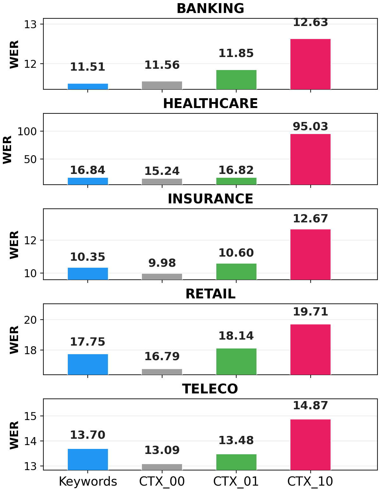

<!--
SPDX-FileCopyrightText: Copyright © 2026 Idiap Research Institute <contact@idiap.ch>

SPDX-License-Identifier: MIT
-->

# Figure 2: Raw context appended to the prompt

The simplest way to give an LLM-based ASR model the dialogue history is to write it into the prompt.
This figure compares, in each domain, the base model with three models whose speech projector is trained with raw context in the prompt:

| Bar in the figure | Run | Prompt context |
|-------------------|-----|----------------|
| CTX_00 | `base` | none ([`prompt_10_CTX_Empty`](../../conf/prompt_10_CTX_Empty.yaml)) |
| Keywords | `raw_kw` | keywords of all previous turns ([`prompt_10_CTX_ALL`](../../conf/prompt_10_CTX_ALL.yaml)) |
| CTX_01 | `raw_ctx:1` | transcript of the previous turn ([`prompt_10_CTX_01`](../../conf/prompt_10_CTX_01.yaml)) |
| CTX_10 | `raw_ctx:10` | transcripts of the last 10 turns ([`prompt_10_CTX_10`](../../conf/prompt_10_CTX_10.yaml)) |

All four are trained for 5 epochs with the encoder and the LLM frozen.
The runs with raw context use a batch size of 4, since their prompts are much longer.

## ▶️ Running it

```bash
bash scripts/figure2/run_all.sh                    # the four bars of every domain
DOMAINS=healthcare bash scripts/figure2/run_all.sh  # one domain
```

To run a single bar, restrict the runs (the base model is always included):

```bash
DOMAINS=banking EXPERIMENTS="raw_ctx:10" bash scripts/figure2/run_all.sh
```

## 📊 Expected results

Once the jobs finish:

```bash
bash scripts/figure2/results.sh
```

Each run writes `WER.txt` next to its checkpoint:

```
exp/definedai/<domain>/base/epoch_5/WER.txt          # CTX_00
exp/definedai/<domain>/raw_kw/epoch_5/WER.txt        # Keywords
exp/definedai/<domain>/raw_ctx_1/epoch_5/WER.txt     # CTX_01
exp/definedai/<domain>/raw_ctx_10/epoch_5/WER.txt    # CTX_10
```

WER (%) of the runs behind the figure, scored with the code in this repository (see [why they differ slightly from the paper](../../README.md#-expected-results)):

<p align="center">
  
</p>

| Domain | CTX_00 | Keywords | CTX_01 | CTX_10 |
|--------|-------:|---------:|-------:|-------:|
| Banking | 11.56 | **11.51** | 11.85 | 12.63 |
| Healthcare | **15.24** | 16.84 | 16.82 | 95.03 |
| Insurance | **9.98** | 10.35 | 10.60 | 12.67 |
| Retail | **16.79** | 17.75 | 18.14 | 19.71 |
| Teleco | **13.09** | 13.70 | 13.48 | 14.87 |

Adding raw context almost always hurts, and the longest history can make decoding collapse (Healthcare, CTX_10).
The whole dialogue history is not included: with raw text it often ran out of GPU memory at this batch size.
