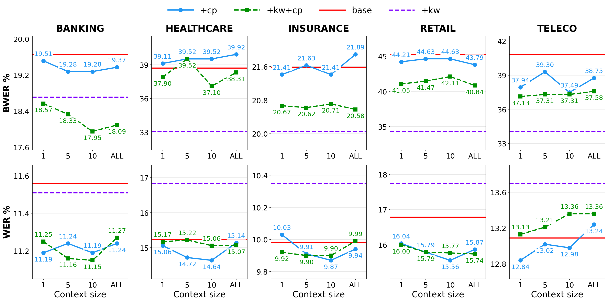

<!--
SPDX-FileCopyrightText: Copyright © 2026 Idiap Research Institute <contact@idiap.ch>

SPDX-License-Identifier: MIT
-->

# Figure 3: Context projection as a function of the context size

This figure trains the context projector on top of each domain's base model, feeding it the Dialog2Flow embeddings of the last 1, 5, 10 or all previous turns, and plots WER and bias WER (BWER) against that context size:

| Line in the figure | Runs | What the LLM receives besides the speech |
|--------------------|------|------------------------------------------|
| +cp (blue, solid) | `cp:1` `cp:5` `cp:10` `cp:ALL` | one projected context token per previous turn |
| +kw+cp (green, dashed) | `kw_cp:1` `kw_cp:5` `kw_cp:10` `kw_cp:ALL` | the same, plus the keywords of all previous turns as text |
| base (red) | `base` | nothing |
| +kw (purple, dashed) | `raw_kw` | the keywords of all previous turns as text |

The context projector is trained for 2 epochs, starting from `base/epoch_5/model.pt`, with the speech encoder, the speech projector and the LLM frozen.

## ▶️ Running it

```bash
bash scripts/figure3/run_all.sh                     # every line of every domain
DOMAINS=retail bash scripts/figure3/run_all.sh      # one domain
DOMAINS=retail EXPERIMENTS="kw_cp:5" bash scripts/figure3/run_all.sh   # one point
```

The context projector jobs wait for the base model of their domain, so everything can be queued at once.

## 📊 Expected results

Once the jobs finish:

```bash
bash scripts/figure3/results.sh
```

Each run writes `WER.txt` next to its checkpoint, and `results.sh` adds `BWER.txt`:

```
exp/definedai/<domain>/cp_ctx_<CTX>/epoch_2/       # +cp
exp/definedai/<domain>/kw_cp_ctx_<CTX>/epoch_2/    # +kw+cp
exp/definedai/<domain>/base/epoch_5/               # base
exp/definedai/<domain>/raw_kw/epoch_5/             # +kw
```

WER / BWER (%) of the runs behind the figure, scored with the code in this repository (see [why they differ slightly from the paper](../../README.md#-expected-results)):

<p align="center">
  
</p>

| Domain | System | CTX 1 | CTX 5 | CTX 10 | CTX ALL |
|--------|--------|------:|------:|-------:|--------:|
| Banking | +cp | 11.19 / 19.51 | 11.24 / 19.28 | 11.19 / 19.28 | 11.24 / 19.37 |
| | +kw+cp | 11.25 / 18.57 | 11.16 / 18.33 | 11.15 / 17.95 | 11.27 / 18.09 |
| Healthcare | +cp | 15.06 / 39.11 | 14.72 / 39.52 | 14.64 / 39.52 | 15.14 / 39.92 |
| | +kw+cp | 15.17 / 37.90 | 15.22 / 39.52 | 15.06 / 37.10 | 15.07 / 38.31 |
| Insurance | +cp | 10.03 / 21.41 | 9.91 / 21.63 | 9.87 / 21.41 | 9.94 / 21.89 |
| | +kw+cp | 9.92 / 20.67 | 9.90 / 20.62 | 9.90 / 20.71 | 9.99 / 20.58 |
| Retail | +cp | 16.04 / 44.21 | 15.79 / 44.63 | 15.56 / 44.63 | 15.87 / 43.79 |
| | +kw+cp | 16.00 / 41.05 | 15.79 / 41.47 | 15.77 / 42.11 | 15.74 / 40.84 |
| Teleco | +cp | 12.84 / 37.94 | 13.02 / 39.30 | 12.98 / 37.49 | 13.24 / 38.75 |
| | +kw+cp | 13.13 / 37.13 | 13.21 / 37.31 | 13.36 / 37.31 | 13.36 / 37.58 |

And the two reference lines, which do not depend on the context size:

| Domain | base | +kw |
|--------|-----:|----:|
| Banking | 11.56 / 19.66 | 11.51 / 18.71 |
| Healthcare | 15.24 / 38.71 | 16.84 / 33.06 |
| Insurance | 9.98 / 21.58 | 10.35 / 20.05 |
| Retail | 16.79 / 45.26 | 17.75 / 34.32 |
| Teleco | 13.09 / 40.83 | 13.70 / 34.06 |

Adding the keywords to the context projector lowers BWER at every context size but one (a tie in Healthcare, CTX 5), and a history of about 10 turns is usually enough.
